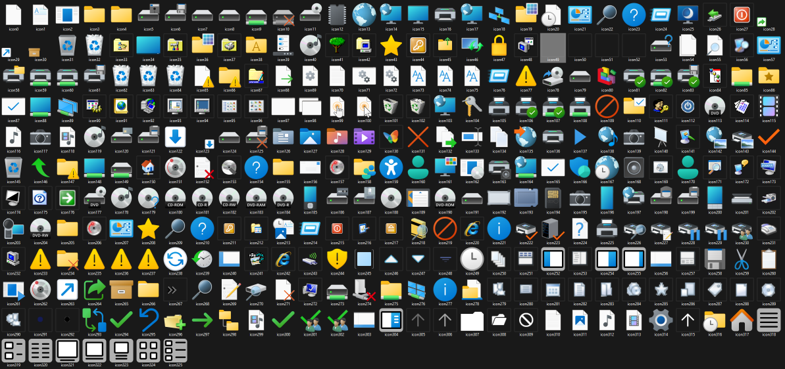

## Icon Library Harvester

Extract icons from icon libraries

---

### Usage example


Extract all icons contained in a icon library SHELL32.dll to folder shell32Extracted

```shell
IconLibraryHarvester.exe "C:\windows\System32\SHELL32.dll" shell32Extracted
```


